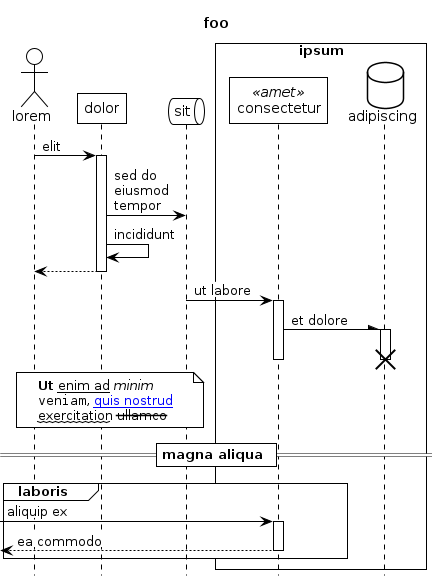
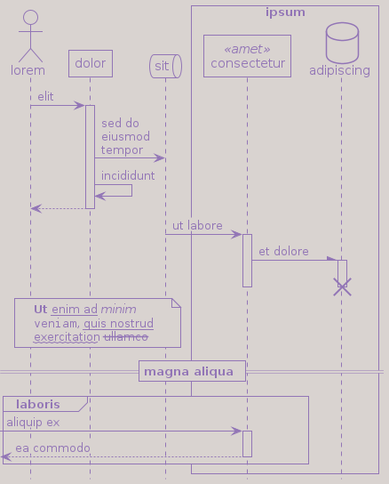

# Base Theme



# Mimeograph

<a href="{{site.repository_url}}/tree/main/examples/mimeograph.puml"></a>


<pre><code>{{ page | jsonify  | escape }}</code></pre>
<pre><code>{{ site | jsonify  | escape }}</code></pre>
<pre><code>{{ jekyll.environment | jsonify | escape }}</code></pre>


```plantuml
title bar
```

{{ foo | markdownify }}

include_relative generated/includes/mimeograph.iuml %}</code></pre>
